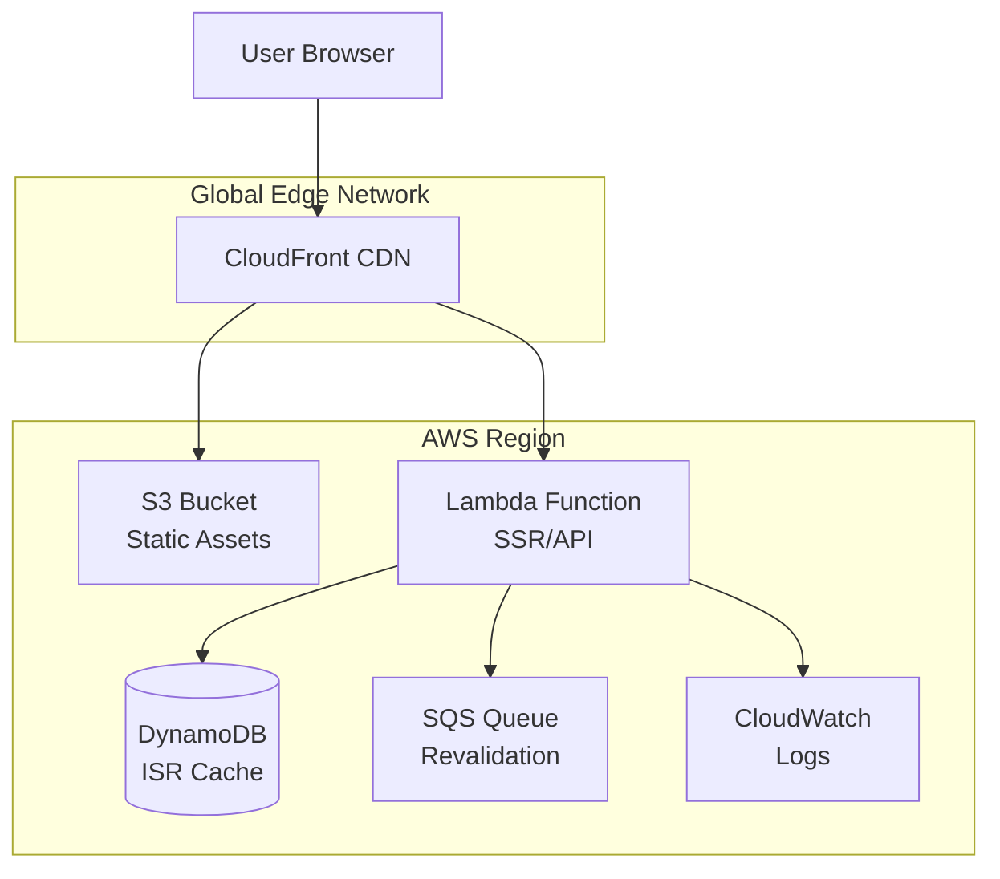
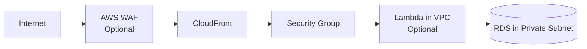
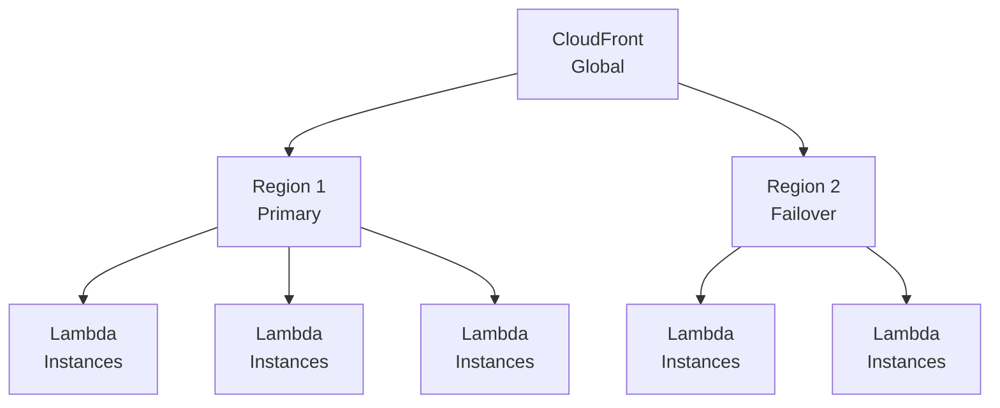
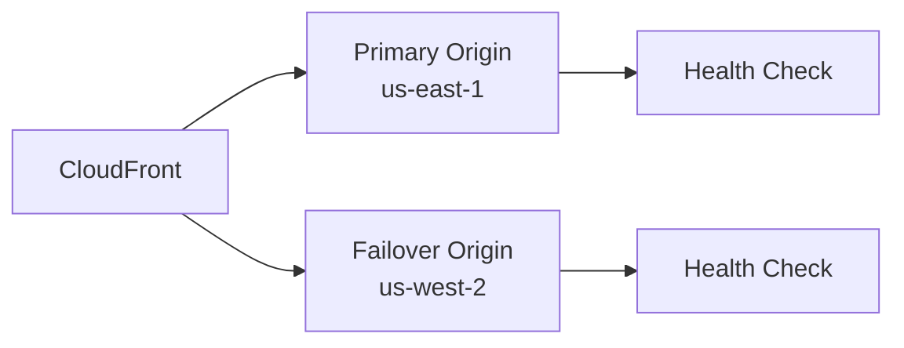
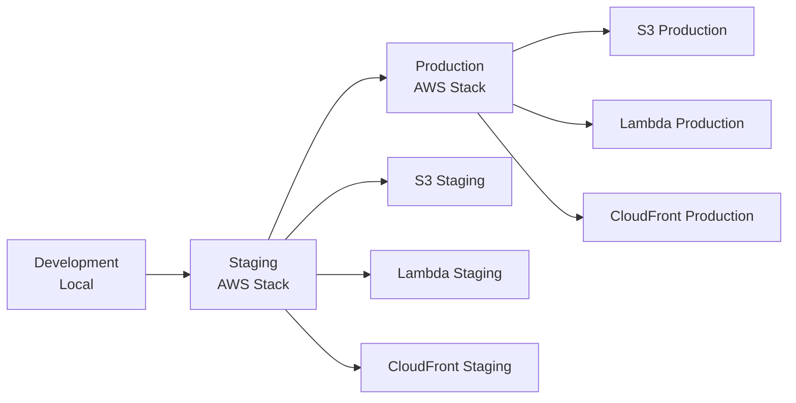

# Architecture Deep Dive

## System Overview

Our platform implements a modern serverless architecture on AWS, optimized for web applications with both static and dynamic content. This guide explains how everything works under the hood.

## High-Level Architecture



## Request Flow

### 1. Static Asset Request
```
User → CloudFront → S3 Bucket → CloudFront Cache → User
```
- Assets cached at edge locations globally
- Automatic compression (gzip/brotli)
- Immutable caching for versioned assets

### 2. Dynamic Request (SSR)
```
User → CloudFront → Lambda Function → CloudFront → User
```
- Lambda executes server-side rendering
- Response cached based on headers
- Streaming support for better TTFB

### 3. API Request
```
User → CloudFront → Lambda Function → Database/Services → Lambda → CloudFront → User
```
- Direct routing to Lambda
- No caching for POST/PUT/DELETE
- Optional caching for GET requests

## Component Architecture

### Lambda Functions

#### Server Function (Main)
Handles all dynamic requests including SSR and API routes.

**Configuration:**
- **Runtime**: Node.js 20.x
- **Architecture**: ARM64 (Graviton2)
- **Memory**: 512-3008 MB (configurable)
- **Timeout**: 10-30 seconds
- **Concurrency**: Auto-scaling (1000 default)

**Optimizations:**
- Provisioned concurrency for cold start reduction
- Connection pooling for database connections
- Response streaming for large payloads

#### Image Optimization Function (Next.js)
Dedicated function for on-demand image processing.

**Configuration:**
- **Memory**: 1536-3008 MB
- **Timeout**: 30 seconds
- **Sharp library**: Pre-compiled for Lambda

**Features:**
- Format conversion (WebP, AVIF)
- Resize and quality adjustment
- Cache headers for CDN optimization

#### Revalidation Function (Next.js ISR)
Handles incremental static regeneration.

**Configuration:**
- **Triggered by**: SQS messages
- **Memory**: 512 MB
- **Timeout**: 300 seconds

**Process:**
1. Receives revalidation request
2. Rebuilds specific pages
3. Updates S3 and DynamoDB
4. Purges CloudFront cache

### CloudFront Distribution

#### Origin Configuration

**S3 Origin (Static Assets)**
```typescript
{
  domainName: bucket.bucketRegionalDomainName,
  originId: "s3-assets",
  s3OriginConfig: {
    originAccessIdentity: oai.cloudfrontAccessIdentityPath,
  },
}
```

**Lambda Origin (Dynamic Content)**
```typescript
{
  domainName: functionUrl.hostname,
  originId: "lambda-ssr",
  customOriginConfig: {
    httpPort: 80,
    httpsPort: 443,
    originProtocolPolicy: "https-only",
    originSslProtocols: ["TLSv1.2"],
  },
}
```

#### Cache Behaviors

**Static Assets (_next/static/, assets/)**
- **Cache Policy**: Managed-CachingOptimized
- **TTL**: 31536000 seconds (1 year)
- **Compression**: Enabled
- **Query String**: Ignored

**Dynamic Content (/, /api/)**
- **Cache Policy**: Custom or Disabled
- **TTL**: 0-86400 seconds
- **Origin Request Policy**: AllViewerExceptHostHeader
- **Methods**: GET, HEAD, OPTIONS, PUT, POST, PATCH, DELETE

### S3 Storage

#### Bucket Structure
```
my-app-bucket/
├── _next/
│   ├── static/        # Immutable assets
│   │   ├── chunks/    # JS chunks
│   │   ├── css/       # CSS files
│   │   └── media/     # Images, fonts
│   └── data/          # JSON data
├── assets/            # Public assets
├── cache/             # ISR cache (Next.js)
└── server/            # Server assets
```

#### Security Configuration
- **Public Access**: Blocked
- **Access**: CloudFront OAI only
- **Encryption**: AES-256
- **Versioning**: Optional
- **Lifecycle**: Old version cleanup

### DynamoDB (Next.js ISR)

#### Table Schema
```typescript
{
  TableName: "my-app-isr-cache",
  KeySchema: [
    { AttributeName: "tag", KeyType: "HASH" },
    { AttributeName: "path", KeyType: "RANGE" }
  ],
  BillingMode: "PAY_PER_REQUEST",
  PointInTimeRecovery: { Enabled: true }
}
```

#### Usage Pattern
- Stores ISR cache tags
- Enables targeted revalidation
- Automatic expiration with TTL

### SQS Queue (Next.js ISR)

#### Configuration
```typescript
{
  QueueName: "my-app-revalidation",
  VisibilityTimeout: 300,
  MessageRetentionPeriod: 3600,
  ReceiveMessageWaitTimeSeconds: 10,
  FifoQueue: true,
  ContentBasedDeduplication: true
}
```

## Framework-Specific Architecture

### Next.js Architecture

#### OpenNext v3 Integration
```
Next.js App → OpenNext Build → 
├── Server Function (SSR/API)
├── Image Function (Optimization)
├── Revalidation Function (ISR)
└── Static Assets (S3)
```

#### Build Output Structure
```
.open-next/
├── server-function/      # Main Lambda
├── image-optimization/   # Image Lambda
├── revalidation/        # ISR Lambda
├── assets/              # Static files
└── cache/               # Build cache
```

### SvelteKit Architecture

#### Custom Adapter
```
SvelteKit App → Adapter Build →
├── Server Function (SSR/API)
├── Prerendered Pages (S3)
└── Static Assets (S3)
```

#### Handler Implementation
```typescript
// Lambda handler for SvelteKit
export async function handler(event) {
  const { render } = await import('./server/index.js');
  const response = await render({
    url: event.rawPath,
    headers: event.headers,
    method: event.requestContext.http.method,
    body: event.body,
  });
  return formatResponse(response);
}
```

### React Router Architecture

#### Build Process
```
React Router App → Vite Build →
├── Server Bundle (Lambda)
├── Client Bundle (S3)
└── Static Assets (S3)
```

#### Server Entry Point
```typescript
// Lambda handler for React Router
import { createRequestHandler } from "@react-router/architect";
export const handler = createRequestHandler({
  build: await import("./build/server/index.js"),
});
```

## Performance Architecture

### Cold Start Optimization

#### Strategies Implemented
1. **ARM64 Architecture**: 20% better price-performance
2. **Optimized Bundle Size**: Tree-shaking and minification
3. **Provisioned Concurrency**: Pre-warmed instances
4. **Lambda Layers**: Shared dependencies
5. **Connection Pooling**: Reuse database connections

#### Typical Cold Start Times
- **Next.js**: 800-1200ms
- **SvelteKit**: 400-600ms
- **React Router**: 500-700ms

### Response Time Optimization

#### Techniques Used
1. **Streaming Responses**: First byte faster
2. **Edge Caching**: Global CDN
3. **Compression**: Brotli/Gzip
4. **HTTP/2 & HTTP/3**: Multiplexing
5. **Preloading**: Critical resources

#### Performance Metrics
- **TTFB**: < 200ms (cached), < 800ms (dynamic)
- **FCP**: < 1.5s
- **LCP**: < 2.5s
- **CLS**: < 0.1

## Security Architecture

### Network Security



### IAM Roles and Policies

#### Lambda Execution Role
```typescript
{
  Version: "2012-10-17",
  Statement: [
    {
      Effect: "Allow",
      Action: [
        "logs:CreateLogGroup",
        "logs:CreateLogStream",
        "logs:PutLogEvents"
      ],
      Resource: "arn:aws:logs:*:*:*"
    },
    {
      Effect: "Allow",
      Action: ["s3:GetObject", "s3:PutObject"],
      Resource: "arn:aws:s3:::my-bucket/*"
    },
    {
      Effect: "Allow",
      Action: ["dynamodb:*"],
      Resource: "arn:aws:dynamodb:*:*:table/my-table"
    }
  ]
}
```

### Data Protection

#### Encryption at Rest
- **S3**: AES-256 encryption
- **DynamoDB**: AWS managed keys
- **Lambda Environment**: KMS encryption

#### Encryption in Transit
- **CloudFront to Origin**: TLS 1.2+
- **Client to CloudFront**: TLS 1.2+ with SNI
- **Lambda to Services**: HTTPS only

## Scalability Architecture

### Auto-Scaling Behavior

#### Lambda Scaling
- **Concurrent Executions**: 1000 (default)
- **Burst Capacity**: 3000 (initial)
- **Scale Rate**: 500 instances/minute

#### CloudFront Scaling
- **Edge Locations**: 450+ globally
- **Unlimited Capacity**: No configuration needed
- **DDoS Protection**: AWS Shield Standard

### Load Distribution



## Cost Architecture

### Pricing Components

#### Compute Costs
```
Lambda Cost = Requests × Price per Request + GB-seconds × Price per GB-second
```

#### Storage Costs
```
S3 Cost = Storage GB × $0.023 + Requests × $0.0004
```

#### Transfer Costs
```
CloudFront Cost = Data Transfer GB × Region Rate + Requests × $0.01 per 10,000
```

### Cost Optimization Strategies

1. **ARM64 Lambda**: 20% cost reduction
2. **S3 Intelligent-Tiering**: Automatic cost optimization
3. **CloudFront Caching**: Reduce origin requests
4. **Reserved Capacity**: For predictable workloads
5. **Spot Instances**: For batch processing

## Monitoring Architecture

### CloudWatch Integration

#### Metrics Collected
- **Lambda**: Invocations, errors, duration, throttles
- **CloudFront**: Requests, bytes, errors, cache hit ratio
- **S3**: Requests, bytes, 4xx/5xx errors
- **DynamoDB**: Read/write capacity, throttles

#### Custom Metrics
```typescript
// Custom metric example
await cloudwatch.putMetricData({
  Namespace: 'MyApp/Performance',
  MetricData: [{
    MetricName: 'RenderTime',
    Value: renderTime,
    Unit: 'Milliseconds',
    Dimensions: [
      { Name: 'Route', Value: routePath },
      { Name: 'Environment', Value: 'production' }
    ]
  }]
}).promise();
```

### Alarm Configuration

#### Critical Alarms
```typescript
{
  AlarmName: 'HighErrorRate',
  MetricName: 'Errors',
  Threshold: 10,
  ComparisonOperator: 'GreaterThanThreshold',
  EvaluationPeriods: 2,
  Period: 300,
  Statistic: 'Sum'
}
```

## Disaster Recovery

### Backup Strategy

#### Data Backup
- **S3**: Cross-region replication
- **DynamoDB**: Point-in-time recovery
- **Code**: Git repository

#### Recovery Objectives
- **RTO**: < 1 hour
- **RPO**: < 1 hour

### Failover Architecture



## Development to Production Pipeline

### Environment Architecture



### Deployment Process

1. **Build Phase**
   - Framework-specific build
   - Asset optimization
   - Bundle analysis

2. **Infrastructure Phase**
   - Pulumi state check
   - Resource provisioning
   - Configuration update

3. **Deployment Phase**
   - S3 asset upload
   - Lambda code update
   - CloudFront invalidation

4. **Verification Phase**
   - Health checks
   - Smoke tests
   - Metric validation

## Advanced Patterns

### Multi-Region Deployment

```typescript
// Pulumi multi-region setup
const regions = ['us-east-1', 'eu-west-1', 'ap-southeast-1'];

regions.forEach(region => {
  const provider = new aws.Provider(`provider-${region}`, { region });
  
  new Next(`app-${region}`, {
    // Configuration
  }, { provider });
});
```

### Blue-Green Deployment

```typescript
// CloudFront weighted routing
{
  Origins: [
    { Id: 'blue', Weight: 90 },
    { Id: 'green', Weight: 10 }
  ]
}
```

### Canary Releases

```typescript
// Lambda alias weighted routing
{
  FunctionName: 'my-app',
  AliasName: 'production',
  FunctionVersion: '$LATEST',
  RoutingConfig: {
    AdditionalVersionWeights: {
      '2': 0.1  // 10% to new version
    }
  }
}
```

## Conclusion

This architecture provides:
- **Scalability**: Handle millions of requests
- **Performance**: Global edge delivery
- **Reliability**: 99.99% uptime SLA
- **Security**: Enterprise-grade protection
- **Cost-Efficiency**: Pay-per-use model

The serverless approach eliminates infrastructure management while providing full control over your application deployment.